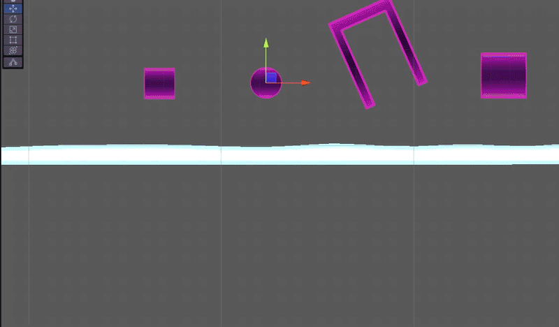

# DeformableSnow2D
Simple effect for 2D side-cam games (Unity). Meshes can be placed anywhere on the ground in the scene and the model will accurately deform when in contact with BoxCollider2D, CircleCollider2D or PolygonCollider2D. You can create your own more complex meshes. It's not exactly pixel perfect and smooth, but it was made for an additional effect in my game, but you might find it useful for your game too :) Also the snow can be regenerated or melted by time.

## Limitations
The script is simple, written for purpose of snow effects in my levels so there are limitations:

1. <b>Box Colliders</b> - due to optimization, the box colliders haven't any calculations except the size, so the it's <b>not working with rotation</b> - however for "pixel perfect" collision you can still use polygon collider
2. <b>Polygon colliders</b> are probably quite expensive due to many calculations, so I recommend use them in small amount :)
3. Directions - there is no support for another gravity, however I made experiments with more complex terrains and more waving meshes and it seems to be working very well :)
4. Only one path polygon colliders are supported
5. Not absolutely pixel perfect, but this can be probably improved by more complex mesh, but it's not purpose of this simple script :)

## Use of example
You can use my predefined meshes with ready-to-place GameObjects in example scene. which should be working without problems. I have one smaller snow and one long which is fitting the most level scenarious. You can adjust the diffuse texture, replace with custom material or use it as it is :)

## Creating custom meshes
You can create custom snow mesh very simply, there are just a few things to have in mind:
1. Create your mesh in your 3D editor
2. For the biggest variability, the lowest vertices (which should not be deformed by script) can be placed anywhere not just at zero position, but it's important to set them vertex color smaller (Red channel) then 1 (0.99 works fine with my meshes :)), so script will find them and deformation will be ignored
3. IMPORTANT - after importing to Unity, you must allow Read/Write in mesh settings

## Assigning script
1. Place mesh into the scene
2. Assign DeformableSnow2D script to your GameObject
3. Now you must choose every collider to the currentCollidersWithSnow List (supported colliders are BoxCollider2D, CircleCollider2D and PolygonCollider2D). It's possible to let the script find all colliders in the scene, but I don't recommend this due to great performance expensiveness, but for small levels it can work.
4. You can also set regenerating (>0) or melting (<0) by regenerationSpeed
5. Enjoy the snow :) (optionaly you can add destroying effect which will be created at vertices positions when lowering)

## License & support
You are totally free to use this scripts and all assets in your project, and if you will like it, you can send me example of your use :) Because it's just a simple script from my game, I can't provide much support, I know it's not a perfect, but it can help someone with improving the game :) You can contact me at satik64@gmail.com.

You can assign any material you like, the example is using standard renderer, but you can easily assign your URP materials if you need. Tested on Unity 2021.3.11f1, probably will be OK with another versions.
